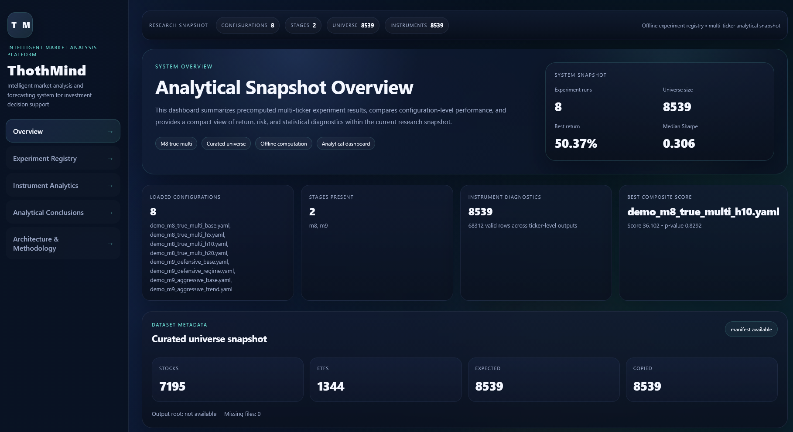
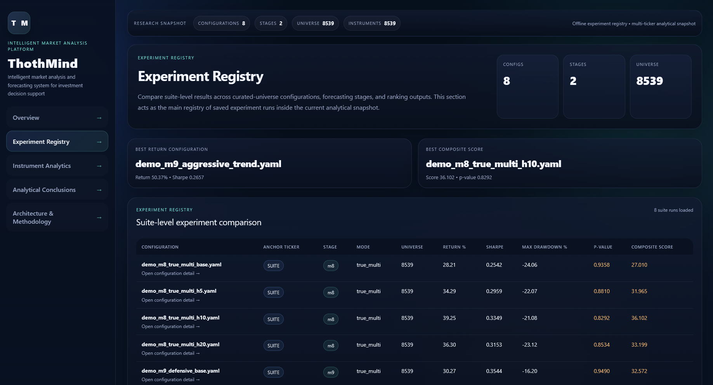
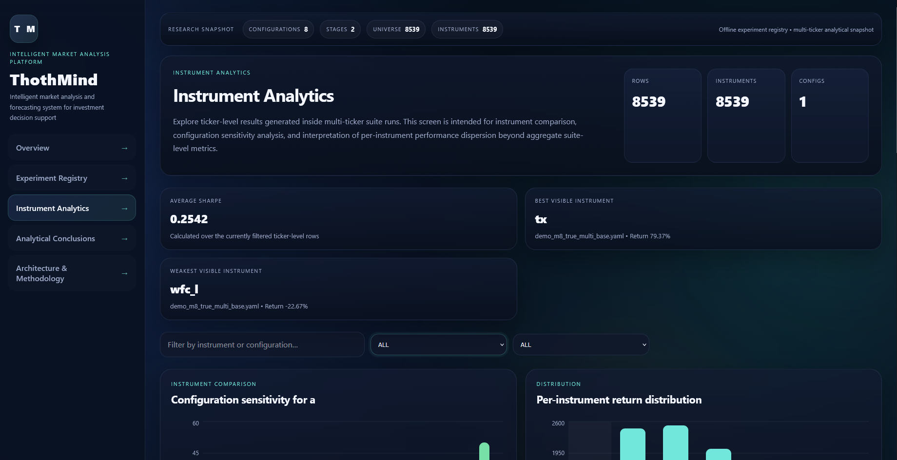

# ThothMind

> **PROPRIETARY / VIEW-ONLY:** No license is granted. All rights reserved. See `LICENSE` for details.

**ThothMind** is a portfolio-grade machine learning and analytical platform for **U.S. stock market analysis, experiment execution, and decision-support-oriented forecasting research**.

ThothMind is designed not as a toy notebook or a one-off dashboard, but as a **structured research platform** with:

- a **Python backend** for offline market experiments,
- a **curated-universe workflow** for reproducible dataset subsets,
- a **batch pipeline** for configuration-based execution,
- a **React + Vite frontend** for analytical inspection and presentation,
- a strict split between **real research artifacts** and **synthetic public demo artifacts**.

---

## What this project demonstrates

ThothMind is structured as an end-to-end engineering case rather than a standalone notebook.

It demonstrates:

- **Python data engineering** for historical market datasets,
- **machine learning experimentation** with configurable research runs,
- **walk-forward validation** and statistical result checks,
- **artifact-based analytics** with reproducible JSON outputs,
- **React + Vite frontend development** for analytical inspection,
- **separation of real research data and public demo data**,
- **clear project packaging** for technical review and portfolio presentation.

---

## Interface preview



<div align="center">
  
  
</div>

---

## Why this project exists

ThothMind solves a practical research and engineering problem:

- raw market research pipelines are often too heavy for quick review,
- purely visual dashboards can look attractive while lacking real backend substance,
- real experiment artifacts and public demo assets require different data strategies.

This platform bridges those needs by combining:

- **real offline backend computation**,
- **artifact-based analytical inspection**,
- **clean frontend analytical presentation**,
- **demo/research data mode separation**.

---

## Key capabilities

- **Historical market data workflow** based on U.S. stocks and ETFs
- **Curated universe selection** from the full raw dataset
- **Materialized research subsets** for reproducible local experimentation
- **Batch execution of experiment configurations**
- **Suite-level and ticker-level result indexing**
- **Research artifact publishing into frontend**
- **Synthetic interface snapshot generation for public demo**
- **Polished analytical frontend**
- **Safe cleanup and rebuild workflow**

---

## Architecture at a glance

```text
Raw Market Dataset
        │
        ▼
Universe Selection
        │
        ▼
Curated Research Subset
        │
        ▼
Batch Experiment Execution
        │
        ├─► reports/index/
        ├─► reports/showcase/
        └─► reports/runs/
                │
                ▼
     ┌─────────────────────────────┐
     │ Frontend Snapshot Publishing│
     └─────────────────────────────┘
         │                   │
         ▼                   ▼
research snapshot       demo snapshot
(real artifacts)      (synthetic UI data)
         │                   │
         └───────────┬───────┘
                     ▼
          React + Vite Analytical UI
```

---

## Dataset

ThothMind uses the Kaggle dataset:

**Huge Stock Market Dataset**  
**Price + Volume Data for All US Stocks & ETFs**

Expected local raw structure:

```text
data/
  Stocks/
  ETFs/
```

The raw dataset is treated as a **local external dependency**:

- it is not intended to be committed to Git,
- it is used as the source for curated research subsets,
- it also serves as the ticker source for synthetic frontend demo generation.

---

## Data modes

ThothMind supports two distinct frontend data modes.

### Research mode

Uses **real backend-generated artifacts**.

Source path:

```text
frontend/public/data/research/
```

Purpose:

- technical review,
- real experiment inspection,
- configuration comparison,
- evidence-based analytical presentation.

### Demo mode

Uses **synthetic interface data built on real ticker symbols**.

Source path:

```text
frontend/public/data/demo/
```

Purpose:

- GitHub Pages / public showcase,
- lightweight click-through demo,
- stable UI showcase without heavy backend recomputation.

### Important distinction

- **Research mode = real experiment outputs**
- **Demo mode = synthetic interface dataset**

The demo mode is designed to preserve structural realism of the interface while avoiding the need to publish or recompute heavy research artifacts.

---

## Quick start

### 1. Backend setup

```powershell
python -m venv .venv
.\.venv\Scripts\Activate.ps1
pip install -r requirements.txt
```

### 2. Frontend setup

```powershell
cd frontend
npm install
cd ..
```

### 3. Generate demo snapshot

```powershell
python -m scripts.generate_demo_frontend_snapshot --data-root data --max-tickers 500 --target-mode demo --clean
```

### 4. Start frontend

```powershell
cd frontend
npm run dev -- --host 127.0.0.1
```

### 5. Open in browser

**Demo mode**
```text
http://127.0.0.1:5173/?dataset=demo
```

**Research mode**
```text
http://127.0.0.1:5173/?dataset=research
```

---

## Recommended real research workflow

### 1. Select a curated universe

```powershell
python -m scripts.select_research_universe --data-root data --preset demo
```

### 2. Materialize the curated subset

```powershell
python -m scripts.materialize_curated_universe --selection-root reports/universe_selection --selection-name demo_30s_10e --output-root data_curated_demo_30s_10e --copy-mode copy --clean
```

### 3. Run the main batch pipeline

```powershell
$tickers = (Get-Content .\data_curated_demo_30s_10e\selected_all.txt | Where-Object { $_.Trim() -ne "" }) -join ","

python -m scripts.run_all_experiments --configs-glob "configs/exp_m8*.yaml" --data-root data_curated_demo_30s_10e --group-by-config --m8-mode true_multi --tickers $tickers
```

### 4. Publish research artifacts into frontend

```powershell
python -m scripts.publish_frontend_snapshot --target-mode research --clean
```

### 5. Open research mode

```text
http://127.0.0.1:5173/?dataset=research
```

---

## Project status

**Current platform baseline:** `platform-v1`

Current emphasis:

- stabilized backend pipeline,
- curated research subset workflow,
- real research artifact publication,
- synthetic demo snapshot generation,
- portfolio-ready frontend presentation,
- safe repository cleanup and packaging.

This repository should be understood as a **coherent research engineering platform**, not as a loose collection of notebooks or isolated ML experiments.

---

## Repository highlights

- `thothmind/` - active backend package
- `scripts/run_all_experiments.py` - current main experiment runner
- `scripts/select_research_universe.py` - universe selection
- `scripts/materialize_curated_universe.py` - curated subset creation
- `scripts/publish_frontend_snapshot.py` - research snapshot publication
- `scripts/generate_demo_frontend_snapshot.py` - synthetic demo snapshot generation
- `scripts/clean_generated_artifacts.py` - safe cleanup utility
- `frontend/` - analytical dashboard
- `configs/` - experiment configuration files

---

## For reviewers

If you are reviewing this repository as a portfolio project, the most relevant parts are:

- `thothmind/` for the backend package structure,
- `scripts/run_all_experiments.py` for batch experiment orchestration,
- `configs/exp_m8*.yaml` for configurable experiment execution,
- `frontend/` for the analytical React interface,
- `frontend/public/data/demo/` for a lightweight public UI snapshot,
- `reports/index/` and `reports/showcase/` for generated research artifacts.

The project is best read as a **research engineering platform**: it combines financial time series data, ML experiments, statistical interpretation, artifact publishing, and a frontend analytical layer.

---

## Who this repository is for

This repository is useful for:

- technical review,
- portfolio presentation,
- research demonstration,
- structured ML / analytics engineering review,
- frontend-backend integration showcase,
- experiment artifact inspection.

It is **not** intended as:

- open reusable library code,
- production trading infrastructure,
- public financial advice system.

---

## Table of contents

1. [Project purpose](#project-purpose)
2. [What the system does](#what-the-system-does)
3. [Dataset](#dataset-1)
4. [Current active architecture](#current-active-architecture)
5. [Repository structure](#repository-structure)
6. [Core concepts](#core-concepts)
7. [Technology stack](#technology-stack)
8. [Environment setup](#environment-setup)
9. [Dataset preparation](#dataset-preparation)
10. [Backend workflows](#backend-workflows)
11. [Frontend workflows](#frontend-workflows)
12. [Research mode vs Demo mode](#research-mode-vs-demo-mode)
13. [Artifacts and output structure](#artifacts-and-output-structure)
14. [CLI reference](#cli-reference)
15. [Typical end-to-end scenarios](#typical-end-to-end-scenarios)
16. [Metrics used in the project](#metrics-used-in-the-project)
17. [Known interpretation limits](#known-interpretation-limits)
18. [Cleanup and repository hygiene](#cleanup-and-repository-hygiene)
19. [Troubleshooting](#troubleshooting)
20. [Development notes](#development-notes)
21. [Disclaimer](#disclaimer)

---

## Project purpose

ThothMind was created as an integrated system for:

- loading and processing historical market data,
- running structured forecasting and backtesting experiments,
- comparing configuration-level and ticker-level performance,
- aggregating analytical results into reusable JSON artifacts,
- publishing these artifacts into a frontend dashboard,
- presenting the system in a polished, review-ready format.

The emphasis of the current platform version is **stabilization, packaging, and demonstration quality**, not unbounded research sprawl.

In practical terms, the current platform centers on:

- reproducible offline runs,
- consistent experiment indexing,
- a curated research universe,
- frontend analytical inspection,
- a separate public demo layer for GitHub Pages / click-through showcase.

---

## What the system does

At a high level, ThothMind follows this pipeline:

1. **Raw market data** is stored locally as text files under `data/Stocks` and `data/ETFs`.
2. A **research universe selection** script scans the raw files and ranks instruments by basic quality and usability.
3. A **curated subset** is materialized into a separate folder for controlled experiments.
4. The main batch runner executes experiment configurations and saves:
   - run directories,
   - logs,
   - suite-level result indexes,
   - ticker-level result indexes,
   - showcase artifacts.
5. A **publish script** copies real backend artifacts into `frontend/public/data/research/...`.
6. A separate **demo generator** creates a synthetic interface dataset on top of **real ticker symbols** and writes it into `frontend/public/data/demo/...`.
7. The React frontend loads either:
   - **real research artifacts**, or
   - **synthetic demo artifacts**,
   depending on the selected dataset mode.

---

## Dataset

ThothMind uses the Kaggle dataset:

**Huge Stock Market Dataset**  
<https://www.kaggle.com/datasets/borismarjanovic/price-volume-data-for-all-us-stocks-etfs>

The dataset is used as the raw historical source for:

- U.S. stocks,
- U.S. ETFs,
- daily OHLCV-style market time series stored as per-ticker files.

In project terms, the dataset is expected to be unpacked into:

```text
data/
  Stocks/
  ETFs/
```

with ticker files inside those folders.

### Important project note

The raw dataset is intentionally treated as a **local external dependency**, not as a repository-tracked asset:

- it is large,
- it should not be committed to Git,
- the repository is designed to work with local raw data plus generated curated subsets and frontend snapshots.

### Why a curated subset is used

The full raw universe is too heavy for repeated full-scale runs on a typical local machine.  
Because of that, ThothMind uses two layers:

1. **Research layer**  
   Real backend results on a curated universe.

2. **Demo layer**  
   Synthetic but structurally realistic frontend data on real ticker symbols, intended for UI demonstration and GitHub Pages.

This design keeps the system both:
- computationally feasible for local development,
- visually convincing for presentation.

---

## Current active architecture

The repository contains historical and legacy traces from earlier research stages, but the **current active execution path** is:

- `thothmind/` - active backend package layer
- `scripts/run_all_experiments.py` - main batch experiment runner
- `scripts/select_research_universe.py` - curated-universe selector
- `scripts/materialize_curated_universe.py` - curated subset materializer
- `scripts/publish_frontend_snapshot.py` - real artifact publisher to frontend
- `scripts/generate_demo_frontend_snapshot.py` - synthetic demo snapshot generator
- `scripts/clean_generated_artifacts.py` - safe project cleanup tool
- `frontend/` - React + Vite analytical dashboard

The frontend is intentionally separated from live model execution.  
Heavy computation happens in Python; the frontend is a presentation and analytical inspection layer.

---

## Repository structure

```text
ThothMind/
├─ analysis/                             # regime-related backend utilities
├─ configs/                              # experiment configuration files
│  ├─ exp_base.yaml
│  ├─ exp_m1.yaml
│  ├─ exp_m2_baseline.yaml
│  ├─ exp_m3_baselines.yaml
│  ├─ exp_m4_walkforward.yaml
│  ├─ exp_m5_ml_walkforward.yaml
│  ├─ exp_m6_conformal.yaml
│  ├─ exp_m7_oos_bootstrap.yaml
│  ├─ exp_m7_oos_bootstrap_h5.yaml
│  ├─ exp_m7_oos_bootstrap_h10.yaml
│  ├─ exp_m7_oos_bootstrap_h20.yaml
│  ├─ exp_m8_multiticker_suite.yaml
│  ├─ exp_m8_multiticker_suite_h5.yaml
│  ├─ exp_m8_multiticker_suite_h10.yaml
│  └─ exp_m8_multiticker_suite_h20.yaml
├─ data/                                 # raw local dataset root (not tracked)
│  ├─ Stocks/
│  └─ ETFs/
├─ data_curated/                         # optional curated outputs
├─ data_curated_demo_30s_10e/            # portable curated demo subset
│  ├─ curated_manifest.json
│  ├─ selected_all.txt
│  ├─ selected_stocks.txt
│  └─ selected_etfs.txt
├─ frontend/                             # React + Vite frontend
│  ├─ public/
│  │  └─ data/
│  │     ├─ demo/
│  │     └─ research/
│  └─ src/
│     ├─ app/
│     ├─ components/
│     ├─ pages/
│     ├─ services/
│     ├─ shared/
│     ├─ styles/
│     └─ widgets/
├─ reports/                              # generated backend artifacts
│  ├─ runs/
│  ├─ index/
│  ├─ showcase/
│  ├─ logs/
│  └─ universe_selection/
├─ scripts/                              # active and supporting scripts
├─ thothmind/                            # active backend package
├─ requirements.txt
└─ README.md
```

---

## Core concepts

### 1. Suite-level results

These are configuration-level analytical outputs.  
Each suite run summarizes an experiment configuration across a group of instruments.

Typical fields:

- `config`
- `stage`
- `suite_mode`
- `n_suite_tickers`
- `return_metric_pct`
- `actual_rel_return_pct`
- `sharpe`
- `max_drawdown_pct`
- `p_value_one_sided`
- `composite_score`  
  in frontend presentation this is displayed more neutrally as **Composite Score**

### 2. Ticker-level results

These are per-instrument results linked to a specific configuration.

Typical fields:

- `config`
- `ticker`
- `status`
- `strat_total_return`
- `strat_sharpe`
- `strat_max_drawdown`
- `actual_rel_return`
- `p_value_one_sided`

### 3. Curated research universe

A smaller, controlled subset of the raw market dataset selected for:

- reasonable compute cost,
- reproducibility,
- higher-quality demonstration.

### 4. Research snapshot

Real artifacts generated from backend runs and published to:

```text
frontend/public/data/research/
```

### 5. Demo snapshot

Synthetic interface data based on real ticker symbols, published to:

```text
frontend/public/data/demo/
```

This is used for:
- public interface showcase,
- GitHub Pages,
- click-through UI demos,
- lightweight frontend development.

---

## Technology stack

### Backend
- Python
- pandas
- numpy
- scikit-learn
- xgboost
- scipy
- statsmodels
- shap
- prophet
- rich
- PyYAML

### Frontend
- React
- TypeScript
- Vite
- Recharts
- React Router
- TanStack Table

### Tooling
- Git / GitHub
- PowerShell or Bash
- local filesystem artifacts
- offline batch-oriented workflow

---

## Environment setup

### Python

Recommended:
- **Python 3.11**

Create and activate a virtual environment.

#### Windows PowerShell
```powershell
python -m venv .venv
.\.venv\Scripts\Activate.ps1
pip install -r requirements.txt
```

#### Bash
```bash
python -m venv .venv
source .venv/bin/activate
pip install -r requirements.txt
```

### Frontend

Inside `frontend/`:

```bash
npm install
```

---

## Dataset preparation

### 1. Download the raw dataset

Download from Kaggle:

```text
https://www.kaggle.com/datasets/borismarjanovic/price-volume-data-for-all-us-stocks-etfs
```

### 2. Unpack into local project structure

Expected layout:

```text
data/
  Stocks/
    AAPL.us.txt
    MSFT.us.txt
    ...
  ETFs/
    SPY.us.txt
    QQQ.us.txt
    ...
```

The exact filename patterns may vary slightly depending on how the dataset is unpacked, but the project expects per-ticker text files inside those two directories.

### 3. Do not commit raw data

The root `.gitignore` is designed so raw market data remains local.

---

## Backend workflows

## 1. Curated research universe selection

This stage scans raw stock and ETF files and selects a smaller subset.

### Script
```text
scripts/select_research_universe.py
```

### What it does

It scans `data/Stocks` and `data/ETFs`, computes basic data quality indicators such as:

- number of rows,
- date coverage,
- fill rates,
- volume-related validity,

and writes selection reports into `reports/universe_selection/...`.

### Example: quick demo preset
```powershell
python -m scripts.select_research_universe --data-root data --preset demo
```

### Example: explicit counts
```powershell
python -m scripts.select_research_universe --data-root data --stock-count 30 --etf-count 10
```

### Example: more explicit full run
```powershell
python -m scripts.select_research_universe `
  --data-root data `
  --stocks-dir Stocks `
  --etfs-dir ETFs `
  --preset demo `
  --min-rows 1000 `
  --min-close-fill 0.95 `
  --min-volume-fill 0.80 `
  --max-zero-volume-share 1.0 `
  --workers 12 `
  --output-dir reports/universe_selection `
  --preview-limit 15
```

### Main parameters

| Parameter | Meaning |
|---|---|
| `--data-root` | root directory containing `Stocks/` and `ETFs/` |
| `--stocks-dir` | stocks subfolder name |
| `--etfs-dir` | ETFs subfolder name |
| `--preset` | selection preset: `demo`, `pilot`, `full` |
| `--stock-count` | explicit stock count override |
| `--etf-count` | explicit ETF count override |
| `--selection-name` | optional output subfolder name |
| `--min-rows` | minimum rows required for eligibility |
| `--min-close-fill` | minimum close fill rate |
| `--min-volume-fill` | minimum volume fill rate |
| `--max-zero-volume-share` | maximum allowed zero-volume share |
| `--workers` | parallel scanning workers |
| `--output-dir` | base output folder |
| `--preview-limit` | how many selected rows to print |

---

## 2. Materialize curated universe

After selection, copy or hardlink selected files into a separate curated folder.

### Script
```text
scripts/materialize_curated_universe.py
```

### What it does

It reads a selection CSV and builds a standalone curated dataset folder, typically with:

- copied instrument files,
- `selected_stocks.txt`
- `selected_etfs.txt`
- `selected_all.txt`
- `curated_manifest.json`

### Example using selection name
```powershell
python -m scripts.materialize_curated_universe `
  --selection-root reports/universe_selection `
  --selection-name demo_30s_10e `
  --output-root data_curated `
  --copy-mode copy `
  --clean
```

### Example with explicit CSV
```powershell
python -m scripts.materialize_curated_universe `
  --selected-csv reports/universe_selection/demo_30s_10e/selected_universe.csv `
  --output-root data_curated_demo_30s_10e `
  --copy-mode copy `
  --clean
```

### Main parameters

| Parameter | Meaning |
|---|---|
| `--selected-csv` | CSV generated by the selection script |
| `--selection-root` | base folder with selection subfolders |
| `--selection-name` | selected subfolder name |
| `--output-root` | destination curated data root |
| `--copy-mode` | `copy` or `hardlink` |
| `--clean` | delete destination before writing |
| `--strict-missing` | fail if any selected source file is missing |

---

## 3. Run experiment batch pipeline

This is the main backend execution path.

### Script
```text
scripts/run_all_experiments.py
```

### What it does

It executes a set of configuration files across a ticker universe, tracks progress, writes logs, records state, and postprocesses results into indexes and showcase artifacts.

This script is the **current primary batch runner**.

### Most important current usage

For the current project stage, **M8 true multi** is the most important operational mode.

### Example: run all M8 configs on the curated demo subset in PowerShell
```powershell
$tickers = (Get-Content .\data_curated_demo_30s_10e\selected_all.txt | Where-Object { $_.Trim() -ne "" }) -join ","

python -m scripts.run_all_experiments `
  --configs-glob "configs/exp_m8*.yaml" `
  --data-root data_curated_demo_30s_10e `
  --group-by-config `
  --m8-mode true_multi `
  --tickers $tickers
```

### Example: same idea in Bash
```bash
tickers=$(paste -sd, data_curated_demo_30s_10e/selected_all.txt)

python -m scripts.run_all_experiments \
  --configs-glob "configs/exp_m8*.yaml" \
  --data-root data_curated_demo_30s_10e \
  --group-by-config \
  --m8-mode true_multi \
  --tickers "$tickers"
```

### Example: resume a partially completed batch
```powershell
python -m scripts.run_all_experiments `
  --configs-glob "configs/exp_m8*.yaml" `
  --data-root data_curated_demo_30s_10e `
  --group-by-config `
  --m8-mode true_multi `
  --tickers $tickers `
  --resume
```

### Main parameters

| Parameter | Meaning |
|---|---|
| `--configs-glob` | glob for config files |
| `--data-root` | root directory with `Stocks/` and `ETFs/` |
| `--output-dir` | run artifact directory |
| `--logs-dir` | batch log directory |
| `--state` | JSONL state file used for resume |
| `--tmp-dir` | temporary config directory |
| `--index-dir` | aggregated index output |
| `--showcase-dir` | showcase folder |
| `--showcase-top` | top-k runs for showcase |
| `--max-tickers` | maximum ticker count, `0` means all |
| `--resume` | skip runs already marked successful |
| `--group-by-config` | iterate by config first |
| `--m8-mode` | `single_ticker` or `true_multi` |
| `--keep-suite-list` | legacy compatibility flag |
| `--skip-postprocess` | skip final indexing / showcase export |
| `--tickers` | optional comma-separated ticker whitelist |

### Important outputs

After a successful run and postprocessing, the script populates:

```text
reports/index/all_results_index.json
reports/index/suite_ticker_results_index.json
reports/showcase/top10_by_return/top10_by_return.json
reports/showcase/top10_by_return/top10_composite_score.json
```

These are the key inputs for frontend publication.

---

## Frontend workflows

## 1. Start frontend in development mode

Go into the frontend directory:

```powershell
cd frontend
npm run dev -- --host 127.0.0.1
```

Open:

```text
http://127.0.0.1:5173/
```

### Why `127.0.0.1` is recommended

In some local environments, `localhost` may behave inconsistently while `127.0.0.1` works reliably.

---

## 2. Production build

```powershell
npm run build
```

Optional preview:

```powershell
npm run preview
```

---

## Research mode vs Demo mode

The frontend supports **two dataset modes**.

## Research mode

Loads **real backend artifacts** from:

```text
frontend/public/data/research/...
```

Use it locally with:

```text
http://127.0.0.1:5173/?dataset=research
```

## Demo mode

Loads **synthetic interface data** from:

```text
frontend/public/data/demo/...
```

Use it with:

```text
http://127.0.0.1:5173/?dataset=demo
```

### Resolution logic

The mode is resolved through:

1. query parameter `?dataset=...`
2. local browser storage
3. default mode
   - local development: `research`
   - GitHub Pages style deployment: `demo`

### How to verify which mode is active

Use browser DevTools → Network and check whether requests go to:

- `/data/research/...`
or
- `/data/demo/...`

---

## Publish real research snapshot to frontend

### Script
```text
scripts/publish_frontend_snapshot.py
```

### What it does

It copies real backend artifacts from `reports/...` into the frontend public research data structure.

### Example
```powershell
python -m scripts.publish_frontend_snapshot --target-mode research --clean
```

### Example with explicit manifest
```powershell
python -m scripts.publish_frontend_snapshot `
  --target-mode research `
  --clean `
  --manifest data_curated_demo_30s_10e/curated_manifest.json
```

### Inputs expected

The script expects the following files to exist:

```text
reports/index/all_results_index.json
reports/index/suite_ticker_results_index.json
reports/showcase/top10_by_return.json       OR reports/showcase/top10_by_return/top10_by_return.json
reports/showcase/top10_composite_score.json   OR reports/showcase/top10_by_return/top10_composite_score.json
curated_manifest.json
```

### Outputs

```text
frontend/public/data/research/index/all_results_index.json
frontend/public/data/research/index/suite_ticker_results_index.json
frontend/public/data/research/showcase/top10_by_return.json
frontend/public/data/research/showcase/top10_composite_score.json
frontend/public/data/research/meta/curated_manifest.json
frontend/public/data/research/meta/publish_overview.json
```

### Main parameters

| Parameter | Meaning |
|---|---|
| `--frontend-dir` | frontend root directory |
| `--reports-dir` | reports directory |
| `--manifest` | path to curated manifest JSON, or `auto` |
| `--target-mode` | target mode: `research` or `demo` |
| `--clean` | delete target mode folder before publish |

---

## Generate synthetic demo snapshot

### Script
```text
scripts/generate_demo_frontend_snapshot.py
```

### What it does

This script creates a **synthetic frontend dataset** using **real ticker symbols** from the raw dataset.

Important:

- the symbols are real,
- the demo metrics are synthetic,
- the result is meant for interface demonstration,
- it must not be presented as real research evidence.

### Example: generate standard demo snapshot
```powershell
python -m scripts.generate_demo_frontend_snapshot `
  --data-root data `
  --max-tickers 500 `
  --target-mode demo `
  --clean
```

### Example: include all available tickers
```powershell
python -m scripts.generate_demo_frontend_snapshot `
  --data-root data `
  --max-tickers 0 `
  --target-mode demo `
  --clean
```

### Main parameters

| Parameter | Meaning |
|---|---|
| `--frontend-dir` | frontend root |
| `--data-root` | raw data root |
| `--stocks-dir` | stocks folder name |
| `--etfs-dir` | ETFs folder name |
| `--target-mode` | usually `demo` |
| `--max-tickers` | ticker limit, `0` means all |
| `--seed` | deterministic synthetic generation seed |
| `--clean` | delete existing target mode folder |

### Outputs

```text
frontend/public/data/demo/index/all_results_index.json
frontend/public/data/demo/index/suite_ticker_results_index.json
frontend/public/data/demo/showcase/top10_by_return.json
frontend/public/data/demo/showcase/top10_composite_score.json
frontend/public/data/demo/meta/curated_manifest.json
frontend/public/data/demo/meta/demo_overview.json
frontend/public/data/demo/meta/selected_tickers_preview.json
```

---

## Artifacts and output structure

### Backend run artifacts

```text
reports/runs/
```

Contains per-run output directories.

### Batch logs

```text
reports/logs/batch/
```

Contains log files for batch execution.

### Aggregated indexes

```text
reports/index/
  all_results_index.json
  suite_ticker_results_index.json
```

### Showcase outputs

```text
reports/showcase/top10_by_return/
  top10_by_return.json
  top10_composite_score.json
```

### Universe selection reports

```text
reports/universe_selection/
```

### Frontend public data

```text
frontend/public/data/
  demo/
    index/
    showcase/
    meta/
  research/
    index/
    showcase/
    meta/
```

---

## Frontend pages

Current major pages:

- **Overview**
- **Experiment Registry**
- **Instrument Analytics**
- **Analytical Conclusions**
- **Architecture & Methodology**
- **Suite Detail Page**

The frontend is intentionally presentation-focused:

- no heavy model training in browser,
- no live retraining,
- no backend API dependency required for the static snapshot workflow.

---

## CLI reference

## `scripts/select_research_universe.py`

```text
python -m scripts.select_research_universe [options]
```

| Parameter | Description |
|---|---|
| `--data-root` | raw data root |
| `--stocks-dir` | stocks folder name |
| `--etfs-dir` | ETFs folder name |
| `--preset` | `demo`, `pilot`, or `full` |
| `--stock-count` | explicit stock count |
| `--etf-count` | explicit ETF count |
| `--selection-name` | output subfolder name |
| `--min-rows` | minimum eligible rows |
| `--min-close-fill` | minimum close fill rate |
| `--min-volume-fill` | minimum volume fill rate |
| `--max-zero-volume-share` | max zero-volume fraction |
| `--workers` | parallel worker count |
| `--output-dir` | output root |
| `--preview-limit` | console preview rows |

---

## `scripts/materialize_curated_universe.py`

```text
python -m scripts.materialize_curated_universe [options]
```

| Parameter | Description |
|---|---|
| `--selected-csv` | explicit selection CSV |
| `--selection-root` | selection root folder |
| `--selection-name` | selection subfolder |
| `--output-root` | curated output root |
| `--copy-mode` | `copy` or `hardlink` |
| `--clean` | delete destination first |
| `--strict-missing` | fail on missing source files |

---

## `scripts/run_all_experiments.py`

```text
python -m scripts.run_all_experiments [options]
```

| Parameter | Description |
|---|---|
| `--configs-glob` | config glob |
| `--data-root` | data root |
| `--output-dir` | run artifact root |
| `--logs-dir` | logs folder |
| `--state` | JSONL resume file |
| `--tmp-dir` | temp config dir |
| `--index-dir` | aggregated index dir |
| `--showcase-dir` | showcase dir |
| `--showcase-top` | top-k showcase count |
| `--max-tickers` | max ticker count, `0` = all |
| `--resume` | skip already successful jobs |
| `--group-by-config` | iterate config-first |
| `--m8-mode` | `single_ticker` or `true_multi` |
| `--keep-suite-list` | legacy compatibility flag |
| `--skip-postprocess` | skip final index generation |
| `--tickers` | comma-separated ticker whitelist |

---

## `scripts/publish_frontend_snapshot.py`

```text
python -m scripts.publish_frontend_snapshot [options]
```

| Parameter | Description |
|---|---|
| `--frontend-dir` | frontend root |
| `--reports-dir` | reports root |
| `--manifest` | path to manifest or `auto` |
| `--target-mode` | `research` or `demo` |
| `--clean` | remove target folder first |

---

## `scripts/generate_demo_frontend_snapshot.py`

```text
python -m scripts.generate_demo_frontend_snapshot [options]
```

| Parameter | Description |
|---|---|
| `--frontend-dir` | frontend root |
| `--data-root` | raw data root |
| `--stocks-dir` | stocks folder |
| `--etfs-dir` | ETFs folder |
| `--target-mode` | `demo` or `research` |
| `--max-tickers` | ticker cap, `0` = all |
| `--seed` | deterministic seed |
| `--clean` | remove target mode before generation |

---

## `scripts/clean_generated_artifacts.py`

```text
python -m scripts.clean_generated_artifacts [options]
```

### Safe full cleanup
```powershell
python -m scripts.clean_generated_artifacts --all
```

### Dry run
```powershell
python -m scripts.clean_generated_artifacts --all --dry-run
```

### Main flags

| Flag | Description |
|---|---|
| `--all` | clean default project-generated artifact set |
| `--python-cache` | remove project-level Python caches |
| `--runs` | remove `reports/runs` |
| `--index` | remove `reports/index` |
| `--showcase` | remove `reports/showcase` |
| `--batch-state` | remove `reports/batch_state*.jsonl` |
| `--logs` | remove `reports/logs/batch` |
| `--tmp-configs` | remove `configs/_batch_tmp` |
| `--universe-selection` | remove `reports/universe_selection` |
| `--frontend-dist` | remove `frontend/dist` |
| `--frontend-research` | remove `frontend/public/data/research` |
| `--frontend-flat-data` | remove deprecated flat frontend data structure |
| `--curated-data` | remove one specific curated data directory |
| `--dry-run` | show actions without deleting |

### Safety guarantees

The cleanup script is intended to avoid touching:

- `.venv/`
- `node_modules/`
- `.git/`
- third-party site-packages

It is designed to remove only project-generated outputs.

---

## Typical end-to-end scenarios

## Scenario A. I only want to run the frontend demo

1. Install backend and frontend dependencies
2. Generate or use existing demo snapshot
3. Start frontend dev server
4. Open demo mode

```powershell
python -m scripts.generate_demo_frontend_snapshot --data-root data --max-tickers 500 --target-mode demo --clean

cd frontend
npm install
npm run dev -- --host 127.0.0.1
```

Open:

```text
http://127.0.0.1:5173/?dataset=demo
```

---

## Scenario B. I want a real research dashboard

1. Prepare raw data
2. Select a curated universe
3. Materialize curated data
4. Run experiment batch
5. Publish research snapshot
6. Open frontend in research mode

```powershell
python -m scripts.select_research_universe --data-root data --preset demo

python -m scripts.materialize_curated_universe `
  --selection-root reports/universe_selection `
  --selection-name demo_30s_10e `
  --output-root data_curated_demo_30s_10e `
  --copy-mode copy `
  --clean
```

```powershell
$tickers = (Get-Content .\data_curated_demo_30s_10e\selected_all.txt | Where-Object { $_.Trim() -ne "" }) -join ","

python -m scripts.run_all_experiments `
  --configs-glob "configs/exp_m8*.yaml" `
  --data-root data_curated_demo_30s_10e `
  --group-by-config `
  --m8-mode true_multi `
  --tickers $tickers
```

```powershell
python -m scripts.publish_frontend_snapshot --target-mode research --clean
```

Then:

```powershell
cd frontend
npm run dev -- --host 127.0.0.1
```

Open:

```text
http://127.0.0.1:5173/?dataset=research
```

---

## Scenario C. I want to refresh everything from a clean state

```powershell
python -m scripts.clean_generated_artifacts --all
python -m scripts.clean_generated_artifacts --frontend-research
python -m scripts.clean_generated_artifacts --frontend-flat-data
```

Then repeat:
- selection,
- materialization,
- experiments,
- publish,
- frontend run.

---

## Metrics used in the project

The exact metric generation may depend on the experiment stage and internal pipeline implementation, but the main platform-level metrics are:

### `return_metric_pct`
Configuration-level total return metric used for top-level comparison.

### `sharpe`
Risk-adjusted quality metric.

### `max_drawdown_pct`
Maximum observed drawdown used as a downside-risk indicator.

### `actual_rel_return_pct` / `actual_rel_return`
Relative return against a benchmark or benchmark-like comparison layer, depending on the stage.

### `p_value_one_sided`
Statistical comparison signal used for interpretation.  
This should not be overclaimed.

### `composite_score`
Internal composite ranking metric.  
In the frontend this is intentionally presented more neutrally as **Composite Score**.

---

## Known interpretation limits

ThothMind is an analytical system, not a promise machine.

Important limits:

1. **Historical results are not guarantees of future performance.**
2. **Demo mode is synthetic.**
3. **Composite score is an internal convenience metric, not a scientific theorem.**
4. **Research mode reflects the currently published artifact snapshot, not a live brokerage connection.**
5. **The frontend is an analytical dashboard, not a real-time trading terminal.**

This is important both researchally and ethically.

---

## Cleanup and repository hygiene

The repository is intentionally structured so that:

- raw dataset stays local,
- generated reports can be removed and rebuilt,
- research snapshots can be republished,
- demo snapshots can be regenerated,
- frontend demo artifacts can be committed when useful,
- frontend research artifacts remain local by default.

Typical tracked assets:
- source code,
- configs,
- frontend code,
- curated demo subset metadata,
- demo public data, if desired for presentation.

Typical untracked assets:
- raw dataset,
- batch runs,
- logs,
- local research snapshots,
- virtual environments,
- frontend build outputs.

---

## Troubleshooting

## `?dataset=research` shows 404 or no data

Cause:
- research snapshot has not been published yet.

Fix:

```powershell
python -m scripts.publish_frontend_snapshot --target-mode research --clean
```

Then reopen:

```text
http://127.0.0.1:5173/?dataset=research
```

---

## `demo` works but `research` does not

This is normal if:
- `frontend/public/data/demo/...` exists,
- `frontend/public/data/research/...` does not exist yet.

The solution is to publish the research snapshot.

---

## Frontend opens on `localhost` inconsistently

Use:

```text
http://127.0.0.1:5173/
```

and start with:

```powershell
npm run dev -- --host 127.0.0.1
```

---

## Batch run is too heavy

Use:
- curated universe selection,
- smaller subset sizes,
- `--max-tickers`,
- M8 runs on a curated subset rather than the full raw dataset.

---

## I want to see what cleanup will remove before running it

Use:

```powershell
python -m scripts.clean_generated_artifacts --all --dry-run
```

---

## Development notes

### Current project direction

The current platform direction prioritizes:

- stability,
- clarity,
- artifact publication,
- frontend presentation quality,
- review-readiness,
- controlled compute scope.

### Historical note

The repository may contain traces of earlier research modules and legacy experiments.  
The current recommended execution path is the one documented in this README.

### Frontend design philosophy

The frontend is intentionally built as a **serious analytical interface**:

- dark institutional style,
- analytical cards,
- charts,
- tables,
- route-level pages,
- research/demo mode separation.

---

## Disclaimer

ThothMind is an engineering and research project created for research, experimentation, and demonstration purposes.

It is **not** financial advice, not a brokerage system, and not a production trading engine.

Any market-related outputs in the platform must be interpreted as analytical results inside a historical or synthetic project context.

---

## Quick command cheat sheet

### Install backend
```powershell
python -m venv .venv
.\.venv\Scripts\Activate.ps1
pip install -r requirements.txt
```

### Install frontend
```powershell
cd frontend
npm install
```

### Start frontend
```powershell
npm run dev -- --host 127.0.0.1
```

### Build frontend
```powershell
npm run build
```

### Select research universe
```powershell
python -m scripts.select_research_universe --data-root data --preset demo
```

### Materialize curated universe
```powershell
python -m scripts.materialize_curated_universe --selection-root reports/universe_selection --selection-name demo_30s_10e --output-root data_curated_demo_30s_10e --copy-mode copy --clean
```

### Run M8 true multi
```powershell
$tickers = (Get-Content .\data_curated_demo_30s_10e\selected_all.txt | Where-Object { $_.Trim() -ne "" }) -join ","

python -m scripts.run_all_experiments --configs-glob "configs/exp_m8*.yaml" --data-root data_curated_demo_30s_10e --group-by-config --m8-mode true_multi --tickers $tickers
```

### Publish research snapshot
```powershell
python -m scripts.publish_frontend_snapshot --target-mode research --clean
```

### Generate demo snapshot
```powershell
python -m scripts.generate_demo_frontend_snapshot --data-root data --max-tickers 500 --target-mode demo --clean
```

### Clean generated artifacts
```powershell
python -m scripts.clean_generated_artifacts --all
```

### Open frontend in demo mode
```text
http://127.0.0.1:5173/?dataset=demo
```

### Open frontend in research mode
```text
http://127.0.0.1:5173/?dataset=research
```
